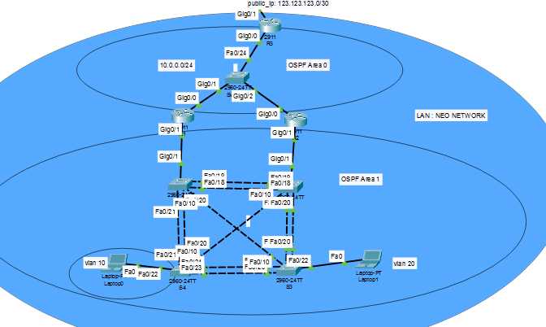
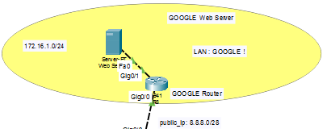

# Lab-tong-hop

## LAN Local

### L2 - Switching
* Thiết lập trunking - đồng bộ vlan giữa các switch và access-port theo vlan tương ứng
  * Trên từng switch tạo vlan 10,20
  * Trunking và VTP để đồng bộ giữa các switch
    ```
    interface range f0/18-24
    switchport mode trunk
    switchport trunk encapsulation dot1q

  * EtherChannel (LACP)
    * Kỹ thuật: Ghép kênh bằng giao thức LACP (802.3ad) để tăng băng thông và tránh loop thông qua việc gộp nhiều link vật lý thành 1 link logic (Port-channel).
    ```
    interface range f0/18-19
    channel-group 1 mode active  # Mode active đại diện cho LACP - Mỗi group tương ứng với 1 etherchanne(gộp cổng)

  * Spanning Tree Protocol (PVST+)
    * Kỹ thuật: Cấu hình Load Balancing thủ công. S1 làm Root Bridge cho VLAN 10 nhưng lại là Backup cho VLAN 20. S2 làm ngược lại.
    * Cấu hình (S1):
    ```
    spanning-tree vlan 10 root primary
    spanning-tree vlan 20 root secondary
  * Port Security & Optimization
    * PortFast: Cấu hình spanning-tree portfast trên các cổng nối Laptop để bỏ qua Forwarding Delay, giúp thiết bị nhận IP tức thì.
    * Security: Chỉ cho phép 1 địa chỉ MAC duy nhất. Chế độ violation restrict giúp Router drop gói tin không hợp lệ nhưng vẫn giữ cổng UP để tránh gián đoạn dịch vụ và gửi cảnh báo về Log.
    ```
    switchport port-security
    switchport port-security maximum 1
    switchport port-security mac-address sticky
    switchport port-security violation restrict
### L3 - Routing
  * Cấu hình Router R1 (DR OSPF)
    ```
    hostname R1
    -- Định tuyến Vlan
    interface g0/0.10
     encapsulation dot1Q 10
     ip address 192.168.10.1 255.255.255.0
    !
    interface g0/0.20
     encapsulation dot1Q 20
     ip address 192.168.20.1 255.255.255.0
    !
    # Subnet nối chung R1-R2-R3 
    interface g0/1
     ip address 10.0.0.1 255.255.255.0
     ip ospf priority 255 # Yêu cầu 8: Priority cao nhất để làm DR - kiểu đường ưu tiên
    ```
    * Cấu hình OSPF chia ra area 0 và 1 nghĩa là khi area 1 chập chờn thì area 0 vẩn không ảnh hưởng gì khu này nghĩa là hệ thống ko bị ảnh hưởng từ area 1
    ``` 
    router ospf 1
     network 192.168.10.0 0.0.0.255 area 1
     network 192.168.20.0 0.0.0.255 area 1
     network 10.0.0.0 0.0.0.255 area 0
    ```
  * R2 tương tự thay đổi priority thành 0 vì ko ưu tiên
  * Cấu hình R3 ( cấu hình NAT ra vùn Wan)
    ```
    hostname R3
    !
    interface g0/0
     ip address 172.16.0.3 255.255.255.0
     ip ospf priority 0 # Yêu cầu 8: Không tham gia bầu chọn DR/BDR
     ip nat inside
    !
    interface g0/1 # Nối ISP
     ip address 123.123.123.2 255.255.255.252
     ip nat outside
    !
    # Yêu cầu 9: PAT cho Vlan 10, 20
    access-list 1 permit 192.168.10.0 0.0.0.255
    access-list 1 permit 192.168.20.0 0.0.0.255
    ip nat inside source list 1 interface g0/1 overload
    !
    # Yêu cầu 10: Cấm range IP 13-23 Vlan 10 ping 123.0/30
    # Tính wildcard cho dải 13-23 khá lẻ, có thể dùng nhiều dòng hoặc dải bao quát
    access-list 100 deny icmp 192.168.10.13 0.0.0.0 123.123.123.0 0.0.0.3
    access-list 100 deny icmp 192.168.10.14 0.0.0.1 123.123.123.0 0.0.0.3
    # ... (tiếp tục cho đến .23)
    =>> Cách khác acl 192.168.10.13 0.0.0.10 ..... ( nghĩa là cấm từ 13 đếnn 13+10)
    !
    # Yêu cầu 11: Cấm IP .100 Vlan 20 telnet R4 (IP R4 giả sử 123.123.123.1)
    access-list 100 deny tcp host 192.168.20.100 host 123.123.123.1 eq 23
    access-list 100 permit ip any any
    !
    interface g0/0
     ip access-group 100 in
    !
    router ospf 1
     network 172.16.0.0 0.0.0.255 area 0
     default-information originate # Đẩy default route cho R1, R2
    !
    ip route 0.0.0.0 0.0.0.0 123.123.123.1


  ## LAN - GOOGLE
  
  * Để máy ngoài truy cập đc web google qua ip public thì mình phải NAT Port Forwarding
  * Như vậy, router sẽ có 2 kiểu NAT khác nhau : 
    * NAT Overload(PAT) để dịch tất cả các IP nguồn (172.16.1.x) cho Lưu lượng gửi đi bằng cách sử dụng IP WAN công cộng (8.8.8.8) được gán cho Giao diện Ge0/0 của Router.
    * Port Forwarding sẽ dịch IP đích và cổng 80 của lưu lượng truy cập đến từ Internet thành IP riêng và cổng 80 của Máy chủ web. Điều này có nghĩa là lưu lượng truy cập đến 8.8.8.8 tại cổng 80 sẽ được dịch sang IP  đích 172.16.1.10 tại cổng 80 (là địa chỉ Máy chủ Web).
    * Cấu hình Router R8 (GOOGLE)
    ```
    hostname R8
    !
    interface g0/0 # Outside
     ip address 8.8.8.1 255.255.255.240
     ip nat outside
    !
    interface g0/1 # Inside nối Web Server (172.16.1.10)
     ip address 172.16.1.1 255.255.255.0
     ip nat inside

    ip route 0.0.0.0 0.0.0.0 8.8.8.1
    !
    
    # Yêu cầu 14: Static NAT Port Forwarding (IP Public 8.8.8.8)
    ip nat inside source static tcp 172.16.1.10 80 8.8.8.8 80
    ip nat inside source static tcp 172.16.1.10 443 8.8.8.8 443
    !
    # Yêu cầu 15: PAT để Webserver ra Internet
    access-list 1 permit 172.16.1.0 0.0.0.255
    ip nat inside source list 1 interface g0/0 overload
  


  
